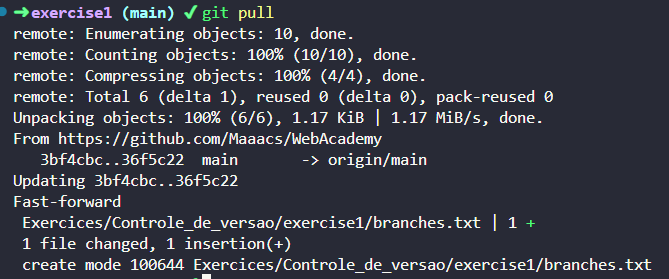
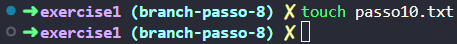

# Laboratório - Aula 01 

# Passo a passo da Prática do Git

1-  Crie uma nova pasta no seu computador para o projeto.

2-  Abra um terminal e navegue até a pasta criada.

3- Crie um repositório remoto no GitHub

4- Integre o repositório local com o remoto

5- Adicione arquivos (pode ser .txt) no repositório local

5(a)- Adicione todos no stage

5(b)- Faça o commit

5(c)- Faça o push para enviar para o repositório remoto

6- Crie um arquivo no repositório remoto diretamente pela página do repositório

7- Faça o pull no repositório local para receber o arquivo criado no repositório remoto

8- Crie uma branch no repositório local

9- Mude para a branch recém criada

10- Adicione na nova branch (passo 8) um arquivo novo e também edite (ou adicione conteúdo) um dos arquivos já criados originalmente na main.

controle.md (modificando arquivo da main)

11-Sincronize o repositório remoto com a nova branch (passo 8) 

12- No repositório remoto, edite o conteúdo de um dos arquivos da branch main.

13- No repositório local, atualize a branch recém criada (passo 8) com a modificação que foi realizada na branch main no repositório remoto.

14- No repositório local, edite um arquivo da branch criada no passo 8.

15- Na main local, faça o merge com a branch criada no passo 8.

16- Sincronize  a main “mergeada” para o repositório remoto.

